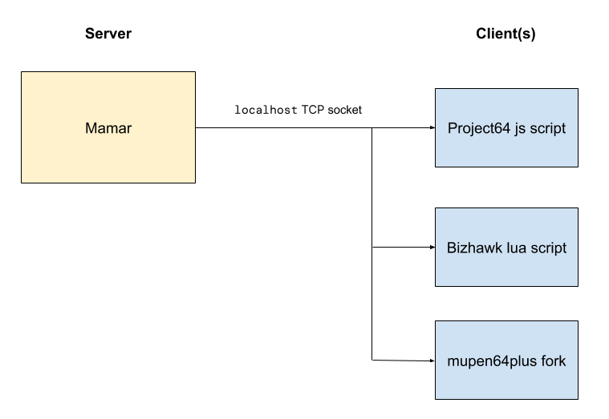

# hot-reload

Paper Mario asset hot-reloading for mod development and reverse-engineering.

---

Supported emulators:

- [Project64](project64/)

Servers:

- [Mamar](https://bgm.imalex.xyz) - BGM hot-reloading
- [NPM package](https://npm.im/@pmret/hot-reload)

---

#### Technical information

See [the protocol](protocol.md).

The client-server model is as follows:

